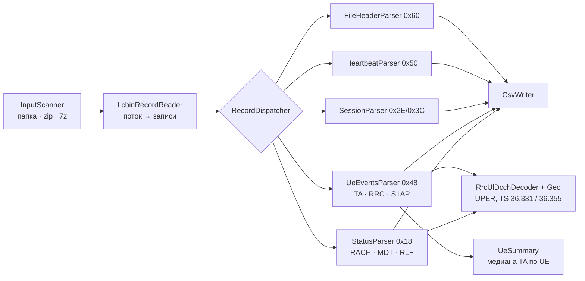

# lcbin-parser

[](https://github.com/akprof2000/lcbin-parser/actions/workflows/ci.yml)
[](https://github.com/akprof2000/lcbin-parser/actions/workflows/release.yml)
[](https://github.com/akprof2000/lcbin-parser/releases/latest)
[](https://adoptium.net/)
[](pom.xml)
[](LICENSE)

Парсер бинарных трасс Nokia eNodeB (`*.lcbin_<bytes>`, поток Nokia Tracer / cell trace) на чистой Java 21, без Spring.
Достаёт из потока всё, что в нём есть:

- **Timing Advance** каждого абонента → расстояние до базовой станции;
- **MeasurementReport**: RSRP/RSRQ обслуживающей соты, соседи LTE, измерения SCell (carrier aggregation), E-CID;
- **GNSS-координаты телефона** (locationInfo в отчётах и в MDT-журнале): широта, долгота, высота, эллипс неопределённости, скорость, курс;
- **MDT-журналы** (logMeasReport): серия измерений по времени с соседями LTE / UMTS (RSCP, EcN0) / GSM (ARFCN, RSSI);
- **RACH-отчёты** (число преамбул, коллизии) и **RLF-отчёты** (сота отказа, причина, сота переустановления);
- идентификаторы S1AP, TAI, Trace Reference, сессии трассировки, heartbeat.

📖 **Документация:** [описание бинарного формата lcbin](docs/FORMAT.md) · [колонки CSV](#выходные-файлы) · [архитектура](#архитектура) · [опции CLI](#опции) · [тесты](#тесты-и-ci)

- Вход: папка с файлами, `.zip`, `.7z` (в том числе с паролем) и вложенные архивы.
- Выход: один CSV на каждый входной поток плюс сводка по UE с медианным TA (нули отброшены).
- Разбор построен из независимых блоков по типам записей, блоки выполняются параллельно.
- Код прокомментирован по-русски: у каждого декодера приведена ASN.1-запись поля, которое он читает.

## Быстрый старт

Готовый jar лежит в [Releases](https://github.com/akprof2000/lcbin-parser/releases/latest).

```bash
java -jar lcbin-parser-1.1.0.jar <input-dir-or-file> <output-dir> --password '<пароль архива>'
```

Сборка из исходников (Maven 3.9+, JDK 21):

```bash
mvn -B package
java -jar target/lcbin-parser-1.1.0.jar traces/ out/
```

### Опции

| Опция | Назначение | По умолчанию |
|---|---|---|
| `--password pw` | пароль для 7z / zip | нет |
| `--threads n` | рабочих потоков | число ядер CPU |
| `--snapshots all\|largest\|median` | какой снимок `*.lcbin_<bytes>` одного потока брать | `all` |
| `--blocks a,b` | блоки: `file-header,heartbeat,session,ue-events,status` | все |
| `--raw` | писать hex декодированных RRC-сообщений | выкл. |
| `--sep ;` | разделитель CSV | `,` |
| `--no-summary` | не писать `*.ue_ta.csv` | выкл. |

Nokia Tracer пишет один TCP-поток снимками растущего размера, где меньший файл является байтовым префиксом
большего. Режим `all` разбирает каждый файл отдельно; `largest`/`median` оставляют по одному снимку на поток.

Коды выхода: `0` успех, `1` хотя бы один вход не разобран (в том числе неверный пароль архива), `2` ошибка аргументов.

## Выходные файлы

**`<имя>.csv`** — все записи потока в порядке следования, единая схема колонок. Фильтруйте по `event`:

| event | Что это |
|---|---|
| `UE_RRC`, `UE_SESSION+RRC` | MeasurementReport абонента (второй вариант — первое сообщение UE, с S1AP-идентификаторами) |
| `UE_TA`, `UE_SESSION+TA` | Timing Advance того же UE, всегда сразу за отчётом с тем же `time_utc` |
| `MDT_LOG` | одна запись MDT-журнала (время = `mdt_abs_time` + `mdt_rel_time_s`) |
| `UE_INFORMATION` | сводка UEInformationResponse: RACH-отчёт, число записей журнала |
| `RLF_REPORT` | отчёт о радиосбое |
| `TRACE_SESSION_START/END` | начало и конец трассировки UE (в END — число сообщений) |
| `HEARTBEAT`, `STATUS`, `FILE_HEADER` | служебные |
| `FRAMING_GAP`, `PARSE_ERROR`, `UE_EVENT_LEFTOVER` | повреждённые данные, байты сохранены в `raw_hex` |

Колонки:

| Колонка | Смысл |
|---|---|
| `record_index`, `record_offset`, `record_type`, `event` | позиция и тип записи, вид события |
| `time_utc` | время eNodeB (для MDT — время телефона), UTC, микросекунды |
| `plmn`, `enb_id`, `cell_id`, `eci` | идентификаторы сети и соты |
| `trace_ref`, `trace_session_ref`, `record_seq` | Trace Reference (PLMN + Trace ID), Trace Recording Session Reference (TS 32.422), счётчик записей |
| `ue_id`, `ue_ctr`, `c_rnti` | локальный идентификатор UE, счётчик событий UE, C-RNTI |
| `enb_ue_s1ap_id`, `mme_ue_s1ap_id`, `tai_plmn`, `tac`, `session_attr` | контекст S1 |
| `timing_advance`, `distance_m` | TA в единицах 16·Ts и расстояние (TA × 78.125 м) |
| `meas_id`, `rsrp_dbm`, `rsrq_db` | измерения обслуживающей соты |
| `neighbors` | соседи: `pci280/f1300:-105dBm/-2.5dB` (LTE), `utra10687/fdd349:rscp-90dBm/ecn0-7dB` (UMTS), `gsm68/dcs1800/ncc1bcc3:rssi-61dBm` (GSM) |
| `scell_results` | измерения SCell: `sf1:-103dBm/-9.5dB` |
| `ecid_rxtx_diff` | E-CID: UE Rx-Tx time difference и SFN |
| `lat`, `lon`, `alt_m`, `loc_uncertainty_m`, `loc_type` | координаты (TS 36.355), тип точки |
| `speed_kmh`, `bearing_deg`, `gnss_tod_ms` | скорость, курс, GNSS time of day |
| `n_msgs` | число сообщений в сессии (END) или записей журнала (UE_INFORMATION) |
| `rrc_message`, `rach_preambles_sent`, `rach_contention` | тип RRC-сообщения, RACH-отчёт |
| `mdt_abs_time`, `mdt_rel_time_s`, `mdt_serv_cell` | MDT: абсолютная метка, смещение, обслуживающая сота `001-01/12345-7` |
| `rlf_details` | RLF: `failedPCell=…;reestablishmentCell=…;timeConnFailure=…;type=hof;cause=t310-Expiry;…` |
| `rrc_hex`, `version`, `raw_hex`, `warning` | сырые байты и предупреждения |

**`<имя>.ue_ta.csv`** — строка на (eNB, сота, `ue_id`, C-RNTI): `ta_median` по ненулевым отсчётам,
`distance_median_m`, `ta_min`, `ta_max`, `rsrp_median_dbm`, время первого и последнего отсчёта.

## Архитектура



| Пакет | Содержимое |
|---|---|
| `io` | `InputScanner`, `ArchiveExtractor`, `LcbinRecordReader`, `SnapshotFilter`, `SourceFile` |
| `codec` | `Varint` (Nokia length-prefixed int), `BitReader` (ASN.1 UPER), `Ids` (PLMN, GlobalENB-ID, ECGI, время) |
| `rrc` | `RrcUlDcchDecoder` (MeasurementReport, UEInformationResponse: RACH / RLF / MDT), `Geo` (координаты TS 36.355) |
| `parsers` | `RecordParser` (интерфейс блока), блоки по типам записей, `ParserRegistry`, `RecordDispatcher` |
| `output` | `CsvWriter`, `UeSummary` |

Блоки не имеют состояния и потокобезопасны. `RecordDispatcher` группирует записи по блокам, режет большие группы на
чанки и выполняет их в пуле потоков, затем восстанавливает исходный порядок. Файлы обрабатываются в отдельном пуле,
чтобы ожидание блоков не блокировало сами блоки. Для отдельной задачи можно поднять свой процесс на подмножестве
блоков: `--blocks ue-events` для одного TA или `ParserRegistry.of(new StatusParser())` из кода.

## Тесты и CI

- `CodecTest`, `RrcDecoderTest` — юнит-тесты на синтетических векторах: сообщения собираются тестовым UPER-кодером
  (`UperWriter`, `SyntheticRrc`) с известными значениями, декодер обязан их вернуть; формулы сверены с pycrate на реальных данных;
- `ParserRobustnessTest` — фаззинг: все префиксы каждой записи, случайные порчи байт и случайный мусор не роняют парсер;
- `EndToEndTest` — весь конвейер: папка, zip, 7z (в том числе с паролем), вложенные архивы, коллизии имён,
  регрессия на deadlock (40 файлов в 1 поток с таймаутом);
- `scripts/smoke.sh` — smoke-прогон собранного jar на `src/test/resources/smoke`, запускается в CI и перед релизом.

Workflow `CI` собирает и тестирует каждый push и pull request (jar как артефакт хранится 1 день).
Workflow `Release` по тегу `v*` собирает jar, гоняет smoke, публикует GitHub Release и удаляет всё, кроме 3 последних релизов:

```bash
git tag v1.1.1 && git push origin v1.1.1
```

## Ограничения

- Не декодируются: rlf-Report за пределами перечисленных полей, connEstFailReport, WLAN/BT-логи, CDMA-соседи (только PCI и сила);
  такие поля пропускаются по правилам расширений UPER, остальное сообщение разбирается.
- Байт `session_attr` (0x28/0x30/0x38) и константы в заголовках записей не расшифрованы.
- Соты с репитером или удалённым RRH (оптика до антенны) дают постоянное смещение TA; переводить его в расстояние там нельзя.
- Тестовые данные в репозитории полностью синтетические (PLMN 001-01, eNB 12345); реальные трассы операторов не публикуются.

## Лицензия

[MIT](LICENSE)
